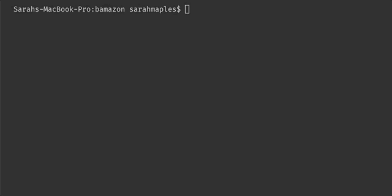
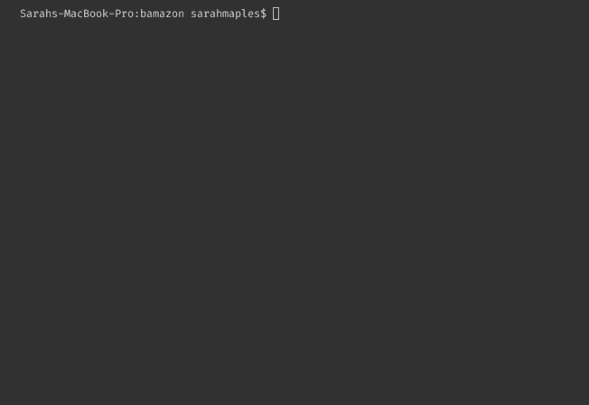
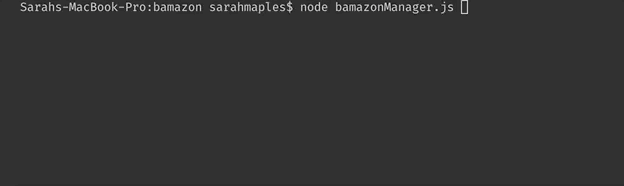
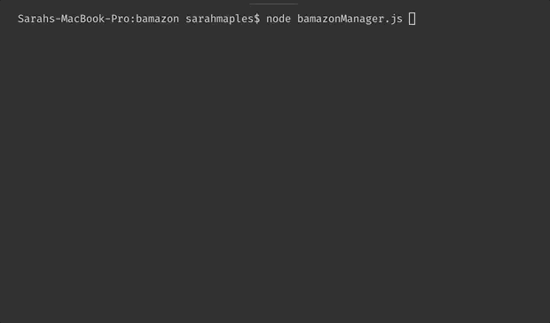

# bamazon

### Customer View

App displays products then prompts user for input.

If there is not enough stock, user will be notified and prompted to pick a new item.

Database is updated if product is available. User prompted to enter a new item.

### Manager View

App displays manager menu with following options: 

1. View Products

Displays all products with non-zero stock.

2. View Low Inventory

Displays items with stock less than or equal to 5.

3. Update Inventoryy

Manager is given list of items to choose. Manager can then specify amount to stock. Database is updated accordingly.

4. Add New Item

Prompts user input then adds new item to bamazon database.